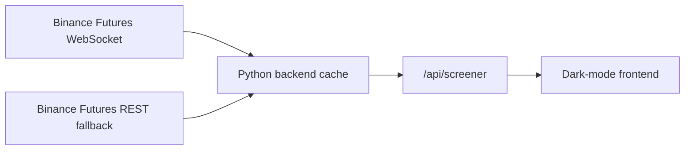

# Binance Futures Screener

[Live app](https://binance-futures-screener-a39v.onrender.com) |
[GitHub repository](https://github.com/unrealwandregime/binance-futures-screener)

A standalone realtime screener for Binance USD-M perpetual futures. It gives traders, analysts, and market surveillance reviewers a fast way to scan the futures universe for unusual movement, volume, open interest, funding, volatility, and short-term trade activity.

This project is intentionally independent. It does not depend on Dash, Plotly, Pandas, CCXT, PostgreSQL, another dashboard repo, or private exchange credentials.

## What It Does

- Fetches public Binance Futures data server-side.
- Serves a dark-mode browser screener that refreshes every second.
- Tracks price, 5-minute change, 1-hour change, 24-hour change, volume, open interest, funding, volatility, and 5-minute trade count.
- Uses a shared backend cache so every visitor is not hitting Binance from their own browser.
- Hydrates heavier per-symbol metrics in rolling batches so the app stays responsive on small hosting plans.
- Shows UTC timestamps, cache age, hydration progress, and feed status in the UI.
- Opens sorted by highest signal first, so the strongest anomaly candidates are at the top immediately.
- Runs on Render Free, Docker, or any small Python web host.

## Live Demo

```text
https://binance-futures-screener-a39v.onrender.com
```

The hosted app uses public Binance market-data endpoints only. There is no account connection and no trading functionality.

## Architecture



The backend prefers Binance WebSocket ticker streams for fresh quote data through the current USD-M futures market route, `wss://fstream.binance.com/market/ws`. If the stream is not warm after a short grace period, it can fall back to Binance REST. Heavier metrics such as open interest, 1-hour volume, volatility, and trade count are fetched separately in controlled batches.

## Tech Stack

- Python
- Flask
- Requests
- websocket-client
- Vanilla HTML, CSS, and JavaScript
- Gunicorn
- Render / Docker deployment

## Local Run

```powershell
python -m venv .venv
.\.venv\Scripts\activate
pip install -r requirements.txt
python server.py
```

Open:

```text
http://127.0.0.1:8050/
```

Health check:

```text
http://127.0.0.1:8050/api/healthz
```

API:

```text
http://127.0.0.1:8050/api/screener
```

## Signal Score

The `Sig` column is a 0-100 anomaly score calculated by this app. Binance does not provide this number.

The score is designed for triage, not prediction. A high score means a symbol deserves attention because several market conditions are unusual at the same time. A low score means the symbol is behaving closer to normal market noise based on the available public data.

Inputs:

- absolute 5-minute price move
- absolute 1-hour price move
- absolute 24-hour price move
- 15-minute high-low volatility
- absolute 1-hour open-interest change
- absolute funding rate
- 24-hour notional volume bonus

Score bands:

| Score | Meaning |
| --- | --- |
| 0-39 | Normal market noise |
| 40-69 | Worth monitoring |
| 70-84 | Strong anomaly |
| 85-100 | Priority review |

## Why Some Cells Say `queued`

Binance publishes quote-level fields for all futures markets quickly. Deep metrics are heavier because they require extra requests per symbol.

To avoid hammering Binance and getting the backend IP rate-limited, the service hydrates those deeper fields in batches. Right after a deploy or restart, lower-volume rows may briefly show `queued`. As the hydration queue progresses, those cells fill in automatically.

## API Contract

`GET /api/screener`

Example response shape:

```json
{
  "status": "live",
  "exchange": "binance",
  "venue": "Binance Futures",
  "source": "binance_ws",
  "generatedAt": "2026-06-26T13:30:00Z",
  "deepGeneratedAt": "2026-06-26T13:29:42Z",
  "cacheAgeMs": 180,
  "streamAgeMs": 420,
  "quoteRefreshMs": 1000,
  "deepRefreshMs": 180000,
  "deepHydratedCount": 420,
  "deepQueuedCount": 0,
  "deepTotalRows": 420,
  "baseRefreshing": false,
  "deepRefreshing": false,
  "lastError": null,
  "rows": []
}
```

## Environment Variables

| Variable | Default | Purpose |
| --- | --- | --- |
| `SCREENER_ENABLE_WS` | `1` | Enables Binance WebSocket streams |
| `BINANCE_WS_BASE` | `wss://fstream.binance.com/market/ws` | Binance USD-M futures market WebSocket base |
| `SCREENER_WS_WARMUP_SECONDS` | `15` | Grace period before REST fallback is allowed during startup |
| `SCREENER_REST_QUOTE_TTL_SECONDS` | `10` | Minimum pause between REST fallback quote refreshes |
| `SCREENER_DEEP_CACHE_TTL_SECONDS` | `180` | Deep metric cache lifetime |
| `SCREENER_DEEP_BATCH_INTERVAL_SECONDS` | `2` | Minimum pause between hydration batches |
| `SCREENER_DEEP_BATCH_SIZE` | `20` | Symbols hydrated per backend batch |
| `SCREENER_DEEP_WORKERS` | `3` | Concurrent deep metric workers |
| `SCREENER_ALLOWED_ORIGINS` | `*` locally | CORS allowlist for browser clients |

Production clamps the numeric settings to reasonable ranges so a bad environment value cannot accidentally overload the host or Binance.

## Deployment

### Render

Create a Render Blueprint from this repository. `render.yaml` defines a free web service named:

```text
binance-futures-screener
```

The current Render app is:

```text
https://binance-futures-screener-a39v.onrender.com
```

### Docker

```bash
docker build -t binance-futures-screener .
docker run --rm -p 8050:7860 binance-futures-screener
```

## Security Posture

This is a read-only public market-data app.

It does not use or store:

- passwords
- private API keys
- exchange account credentials
- database credentials
- seed phrases
- wallet keys
- user sessions

The backend also avoids returning raw upstream error details that could expose infrastructure information, applies basic browser security headers, and restricts CORS in the production Render configuration.

If you fork this project, keep it read-only unless you have a strong reason to do otherwise. Do not add trading permissions, private exchange keys, wallet secrets, or real `.env` files to the repository.

## Limitations

Public futures data is useful for realtime scanning, but it does not prove trader intent or account-level misconduct. Binance may also rate-limit or block hosting-provider IPs. The backend cache centralizes that risk and makes it easier to manage than browser-direct exchange calls.
